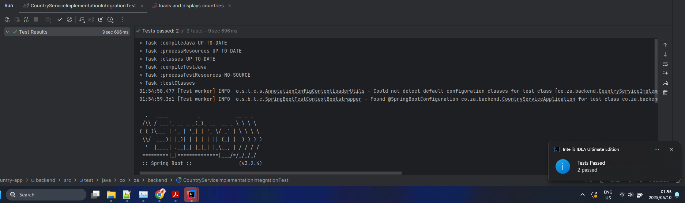
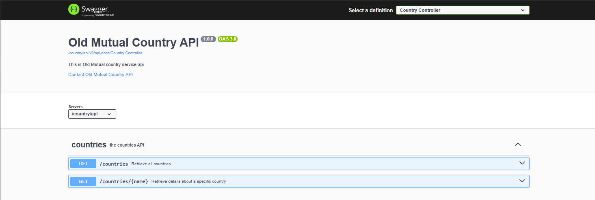
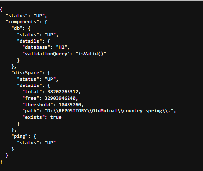

# Running backend Guidelines

### Software Requirements
* java 17
* web browser (chrome, edge or any web browsers)

### Running Instructions
1. Run backend service : './gradlew bootRun'

### Testing backend Instructions

- Unit Tests
  

* Springboot swagger will be available at : 
  http://localhost:8080/api/swagger-ui/index.html

    

* Health check available on link

  http://localhost:8080/country/api/actuator/health

    