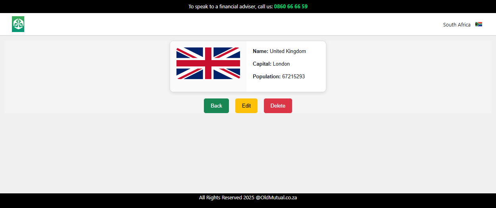

# Running Frontend Guidelines

### Software Requirements
* node 18
* web browser (chrome, edge or any web browsers)

### Running Instructions
1. running react frontend project : `npm start`

### Testing react Instructions

- Unit tests
  

- Application will be available at : [Home page](http://localhost:8081)
     
    
     